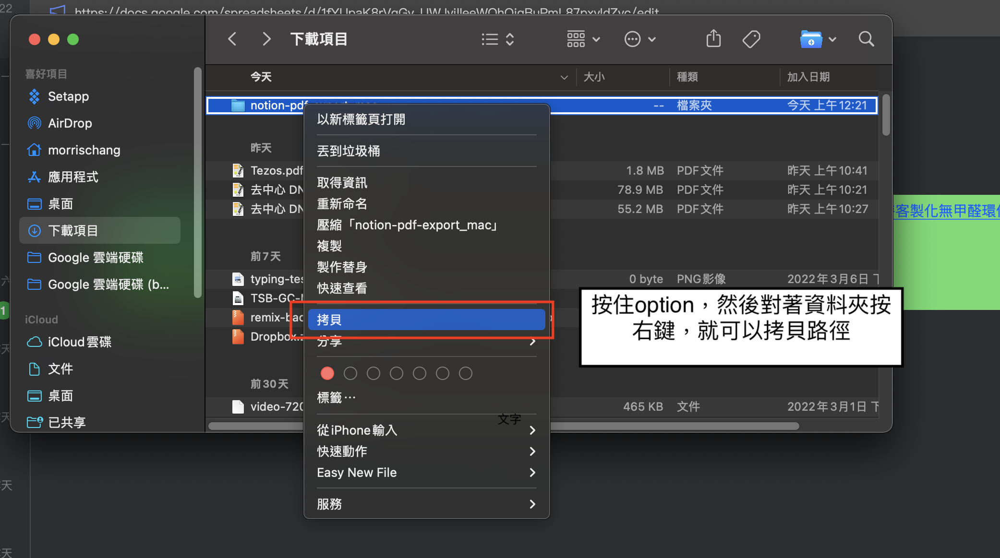

## My Bae's PDF Converter

### TO Do List

- Download chromedriver via this website : https://chromedriver.chromium.org/downloads, !!!NOTE!!! you must check your chrome version before downloading the driver. The following instructions helps you download the driver if needed.

	- 
	- 
	- 
	- 
	- Then, save it in this folder.
- 從<a href="https://www.python.org/downloads/">這裏</a> 下載 Python3
- 打開 應用程式 -> 其他 -> 終端機, type	`python` and press tab, 應該可以看到python3.10出現在底下

- 接下來我們會需要繼續使用終端機，但是在那之前，先用下面的步驟來得到資料夾的路徑：
	- 
- 在終端機打上以下指令然後按enter
```
cd (這邊貼上剛剛的路徑)
pip3 install tqdm
pip3 install pyquery
pip3 install bs4
pip3 install selenium
```
- put all your .html files into  `html` folder
```
# directory should be like this
*---html
|    |
*    +---file_name.html
|    |
*    +---file_name.html
|    |
*    +---file_name.html
```
- run the following command:
```
bash make_pdf.sh 
```

- the final output should be like this:
```
.
.
.
*---html
|    |
*----+---file_name.html
|    |
*----+---file_name.html
|    |
*----+---file_name.html
*---pdf
|    |
*    +---file_name.pdf
|    |
*    +---file_name.pdf
|    |
*    +---file_name.pdf
```


