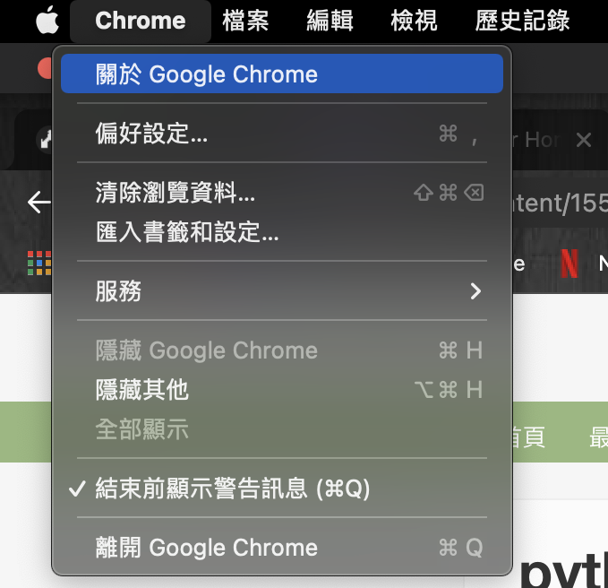
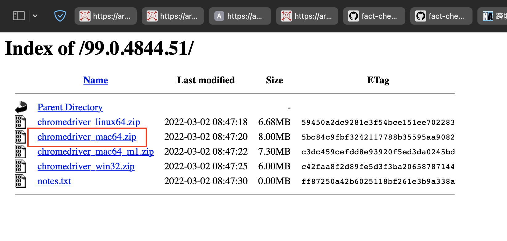

## My Bae's PDF Converter

### TO Do List

- Download chromedriver via this website : https://chromedriver.chromium.org/downloads, !!!NOTE!!! you must check your chrome version before downloading the driver. The following instructions helps you download the driver if needed.

	- 
	- 
	- 
	- 

- 在終端機 (Finder -> 應用程式 -> 其他 -> 終端機) 打上以下指令然後按enter
```
#下面這個先執行 再執行後面那一串, 因為這邊要打密碼
/bin/bash -c "$(curl -fsSL https://raw.githubusercontent.com/Homebrew/install/HEAD/install.sh)" 

#安裝好上面那個 再執行下面這串
brew install git
brew install python@3.8
git clone https://github.com/moooooser999/notion_pdf_converter.git
cd notion_pdf_converter
mv ~/Downloads/chromedriver .
pip3 install tqdm
pip3 install pyquery
pip3 install bs4
pip3 install selenium
```
- put all your .html files into  `html` folder
```
# directory should be like this
*---html
|    |
*    +---file_name.html
|    |
*    +---file_name.html
|    |
*    +---file_name.html
```
- run the following command:
```
bash make_pdf.sh 
```

- the final output should be like this:
```
.
.
.
*---html
|    |
*----+---file_name.html
|    |
*----+---file_name.html
|    |
*----+---file_name.html
|    
*---pdf
|    |
*    +---file_name.pdf
|    |
*    +---file_name.pdf
|    |
*    +---file_name.pdf
```


